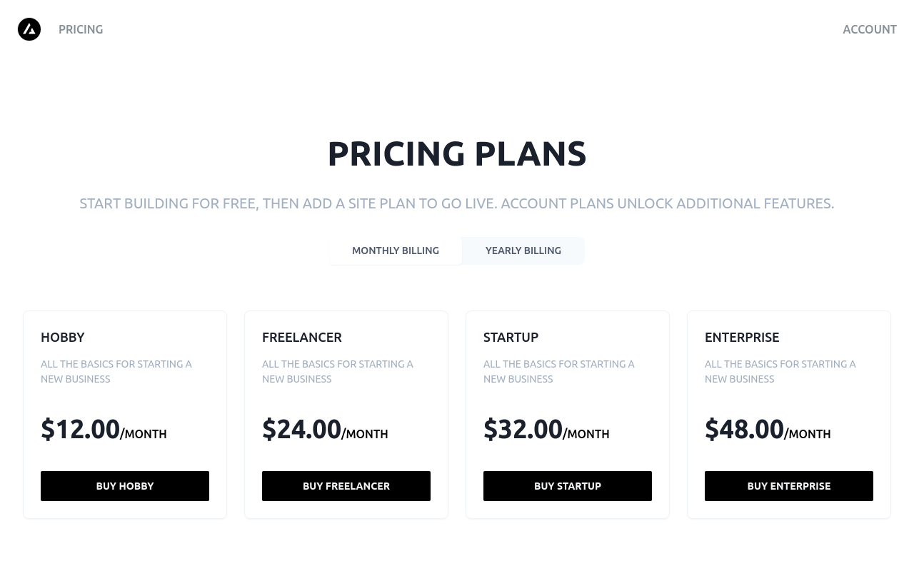
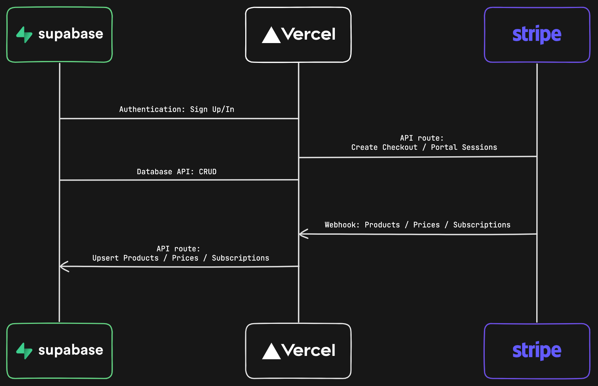

# Next.js Subscription Payments Starter

The all-in-one starter kit for high-performance SaaS applications.

## Features

- Secure user management and authentication with [Supabase](https://supabase.io/docs/guides/auth)
- Powerful data access & management tooling on top of PostgreSQL with [Supabase](https://supabase.io/docs/guides/database)
- Integration with [Stripe Checkout](https://stripe.com/docs/payments/checkout) and the [Stripe customer portal](https://stripe.com/docs/billing/subscriptions/customer-portal)
- Automatic syncing of pricing plans and subscription statuses via [Stripe webhooks](https://stripe.com/docs/webhooks)

## Demo

- https://subscription-payments.vercel.app/

[](https://subscription-payments.vercel.app/)

## Architecture



## Step-by-step setup

When deploying this template, the sequence of steps is important. Follow the steps below in order to get up and running.

### Initiate Deployment

#### Vercel Deploy Button

[](https://vercel.com/new/clone?repository-url=https%3A%2F%2Fgithub.com%2Fvercel%2Fnextjs-subscription-payments&env=NEXT_PUBLIC_STRIPE_PUBLISHABLE_KEY,STRIPE_SECRET_KEY&envDescription=Enter%20your%20Stripe%20API%20keys.&envLink=https%3A%2F%2Fdashboard.stripe.com%2Fapikeys&project-name=nextjs-subscription-payments&repository-name=nextjs-subscription-payments&integration-ids=oac_VqOgBHqhEoFTPzGkPd7L0iH6&external-id=https%3A%2F%2Fgithub.com%2Fvercel%2Fnextjs-subscription-payments%2Ftree%2Fmain)

The Vercel Deployment will create a new repository with this template on your GitHub account and guide you through a new Supabase project creation. The [Supabase Vercel Deploy Integration](https://vercel.com/integrations/supabase) will set up the necessary Supabase environment variables and run the [SQL migrations](./supabase/migrations/20230530034630_init.sql) to set up the Database schema on your account. You can inspect the created tables in your project's [Table editor](https://app.supabase.com/project/_/editor).

Should the automatic setup fail, please [create a Supabase account](https://app.supabase.com/projects), and a new project if needed. In your project, navigate to the [SQL editor](https://app.supabase.com/project/_/sql) and select the "Stripe Subscriptions" starter template from the Quick start section.

### Configure Auth

Follow [this guide](https://supabase.com/docs/guides/auth/social-login/auth-github) to set up an OAuth app with GitHub and configure Supabase to use it as an auth provider.

In your Supabase project, navigate to [auth > URL configuration](https://app.supabase.com/project/_/auth/url-configuration) and set your main production URL (e.g. https://your-deployment-url.vercel.app) as the site url.

Next, in your Vercel deployment settings, add a new **Production** environment variable called `NEXT_PUBLIC_SITE_URL` and set it to the same URL. Make sure to deselect preview and development environments to make sure that preview branches and local development work correctly.

#### [Optional] - Set up redirect wildcards for deploy previews (not needed if you installed via the Deploy Button)

If you've deployed this template via the "Deploy to Vercel" button above, you can skip this step. The Supabase Vercel Integration will have set redirect wildcards for you. You can check this by going to your Supabase [auth settings](https://app.supabase.com/project/_/auth/url-configuration) and you should see a list of redirects under "Redirect URLs".

Otherwise, for auth redirects (email confirmations, magic links, OAuth providers) to work correctly in deploy previews, navigate to the [auth settings](https://app.supabase.com/project/_/auth/url-configuration) and add the following wildcard URL to "Redirect URLs": `https://*-username.vercel.app/**`. You can read more about redirect wildcard patterns in the [docs](https://supabase.com/docs/guides/auth#redirect-urls-and-wildcards).

If you've deployed this template via the "Deploy to Vercel" button above, you can skip this step. The Supabase Vercel Integration will have run database migrations for you. You can check this by going to [the Table Editor for your Supabase project](https://supabase.com/dashboard/project/_/editor), and confirming there are tables with seed data.

Otherwise, navigate to the [SQL Editor](https://supabase.com/dashboard/project/_/sql/new), paste the contents of [the Supabase `schema.sql` file](./schema.sql), and click RUN to initialize the database.

#### [Maybe Optional] - Set up Supabase environment variables (not needed if you installed via the Deploy Button)

If you've deployed this template via the "Deploy to Vercel" button above, you can skip this step. The Supabase Vercel Integration will have set your environment variables for you. You can check this by going to your Vercel project settings, and clicking on 'Environment variables', there will be a list of environment variables with the Supabase icon displayed next to them.

Otherwise navigate to the [API settings](https://app.supabase.com/project/_/settings/api) and paste them into the Vercel deployment interface. Copy project API keys and paste into the `NEXT_PUBLIC_SUPABASE_ANON_KEY` and `SUPABASE_SERVICE_ROLE_KEY` fields, and copy the project URL and paste to Vercel as `NEXT_PUBLIC_SUPABASE_URL`.

Congrats, this completes the Supabase setup, almost there!

### Configure Stripe

Next, we'll need to configure [Stripe](https://stripe.com/) to handle test payments. If you don't already have a Stripe account, create one now.

For the following steps, make sure you have the ["Test Mode" toggle](https://stripe.com/docs/testing) switched on.

#### Create a Webhook

We need to create a webhook in the `Developers` section of Stripe. Pictured in the architecture diagram above, this webhook is the piece that connects Stripe to your Vercel Serverless Functions.

1. Click the "Add Endpoint" button on the [test Endpoints page](https://dashboard.stripe.com/test/webhooks).
1. Enter your production deployment URL followed by `/api/webhooks` for the endpoint URL. (e.g. `https://your-deployment-url.vercel.app/api/webhooks`)
1. Click `Select events` under the `Select events to listen to` heading.
1. Click `Select all events` in the `Select events to send` section.
1. Copy `Signing secret` as we'll need that in the next step (e.g `whsec_xxx`) (/!\ be careful not to copy the webook id we_xxxx).
1. In addition to the `NEXT_PUBLIC_STRIPE_PUBLISHABLE_KEY` and the `STRIPE_SECRET_KEY` we've set earlier during deployment, we need to add the webhook secret as `STRIPE_WEBHOOK_SECRET` env var.

#### Redeploy with new env vars

For the newly set environment variables to take effect and everything to work together correctly, we need to redeploy our app in Vercel. In your Vercel Dashboard, navigate to deployments, click the overflow menu button and select "Redeploy" (do NOT enable the "Use existing Build Cache" option). Once Vercel has rebuilt and redeployed your app, you're ready to set up your products and prices.

#### Create product and pricing information

Your application's webhook listens for product updates on Stripe and automatically propagates them to your Supabase database. So with your webhook listener running, you can now create your product and pricing information in the [Stripe Dashboard](https://dashboard.stripe.com/test/products).

Stripe Checkout currently supports pricing that bills a predefined amount at a specific interval. More complex plans (e.g., different pricing tiers or seats) are not yet supported.

For example, you can create business models with different pricing tiers, e.g.:

- Product 1: Hobby
  - Price 1: 10 USD per month
  - Price 2: 100 USD per year
- Product 2: Freelancer
  - Price 1: 20 USD per month
  - Price 2: 200 USD per year

Optionally, to speed up the setup, we have added a [fixtures file](fixtures/stripe-fixtures.json) to bootstrap test product and pricing data in your Stripe account. The [Stripe CLI](https://stripe.com/docs/stripe-cli#install) `fixtures` command executes a series of API requests defined in this JSON file. Simply run `stripe fixtures fixtures/stripe-fixtures.json`.

**Important:** Make sure that you've configured your Stripe webhook correctly and redeployed with all needed environment variables.

#### Configure the Stripe customer portal

1. Set your custom branding in the [settings](https://dashboard.stripe.com/settings/branding)
1. Configure the Customer Portal [settings](https://dashboard.stripe.com/test/settings/billing/portal)
1. Toggle on "Allow customers to update their payment methods"
1. Toggle on "Allow customers to update subscriptions"
1. Toggle on "Allow customers to cancel subscriptions"
1. Add the products and prices that you want
1. Set up the required business information and links

### That's it

I know, that was quite a lot to get through, but it's worth it. You're now ready to earn recurring revenue from your customers. 🥳

## Develop locally

If you haven't already done so, clone your Github repository to your local machine.

### Install dependencies

Ensure you have [pnpm](https://pnpm.io/installation) installed and run:

```bash
pnpm install
```

Next, use the [Vercel CLI](https://vercel.com/docs/cli) to link your project:

```bash
pnpm dlx vercel login
pnpm dlx vercel link
```

`pnpm dlx` runs a package from the registry, without installing it as a dependency. Alternatively, you can install these packages globally, and drop the `pnpm dlx` part.

If you don't intend to use a local Supabase instance for development and testing, you can use the Vercel CLI to download the development env vars:

```bash
pnpm dlx vercel env pull .env.local
```

Running this command will create a new `.env.local` file in your project folder. For security purposes, you will need to set the `SUPABASE_SERVICE_ROLE_KEY` manually from your [Supabase dashboard](https://app.supabase.io/) (`Settings > API`). If you are not using a local Supabase instance, you should also change the `--local` flag to `--linked' or '--project-id <string>' in the `supabase:generate-types` script in `package.json`.(see -> [https://supabase.com/docs/reference/cli/supabase-gen-types-typescript])

### Local development with Supabase

It's highly recommended to use a local Supabase instance for development and testing. We have provided a set of custom commands for this in `package.json`.

First, you will need to install [Docker](https://www.docker.com/get-started/). You should also copy or rename:

- `.env.local.example` -> `.env.local`
- `.env.example` -> `.env`

Next, run the following command to start a local Supabase instance and run the migrations to set up the database schema:

```bash
pnpm supabase:start
```

The terminal output will provide you with URLs to access the different services within the Supabase stack. The Supabase Studio is where you can make changes to your local database instance.

Copy the value for the `service_role_key` and paste it as the value for the `SUPABASE_SERVICE_ROLE_KEY` in your `.env.local` file.

You can print out these URLs at any time with the following command:

```bash
pnpm supabase:status
```

To link your local Supabase instance to your project, run the following command, navigate to the Supabase project you created above, and enter your database password.

```bash
pnpm supabase:link
```

If you need to reset your database password, head over to [your database settings](https://supabase.com/dashboard/project/_/settings/database) and click "Reset database password", and this time copy it across to a password manager! 😄

🚧 Warning: This links our Local Development instance to the project we are using for `production`. Currently, it only has test records, but once it has customer data, we recommend using [Branching](https://supabase.com/docs/guides/platform/branching) or manually creating a separate `preview` or `staging` environment, to ensure your customer's data is not used locally, and schema changes/migrations can be thoroughly tested before shipping to `production`.

Once you've linked your project, you can pull down any schema changes you made in your remote database with:

```bash
pnpm supabase:pull
```

You can seed your local database with any data you added in your remote database with:

```bash
pnpm supabase:generate-seed
pnpm supabase:reset
```

🚧 Warning: this is seeding data from the `production` database. Currently, this only contains test data, but we recommend using [Branching](https://supabase.com/docs/guides/platform/branching) or manually setting up a `preview` or `staging` environment once this contains real customer data.

You can make changes to the database schema in your local Supabase Studio and run the following command to generate TypeScript types to match your schema:

```bash
pnpm supabase:generate-types
```

You can also automatically generate a migration file with all the changes you've made to your local database schema with the following command:

```bash
pnpm supabase:generate-migration
```

And push those changes to your remote database with:

```bash
pnpm supabase:push
```

Remember to test your changes thoroughly in your `local` and `staging` or `preview` environments before deploying them to `production`!

### Use the Stripe CLI to test webhooks

Use the [Stripe CLI](https://stripe.com/docs/stripe-cli) to [login to your Stripe account](https://stripe.com/docs/stripe-cli#login-account):

```bash
pnpm stripe:login
```

This will print a URL to navigate to in your browser and provide access to your Stripe account.

Next, start local webhook forwarding:

```bash
pnpm stripe:listen
```

Running this Stripe command will print a webhook secret (such as, `whsec_***`) to the console. Set `STRIPE_WEBHOOK_SECRET` to this value in your `.env.local` file. If you haven't already, you should also set `NEXT_PUBLIC_STRIPE_PUBLISHABLE_KEY` and `STRIPE_SECRET_KEY` in your `.env.local` file using the **test mode**(!) keys from your Stripe dashboard.

### Run the Next.js client

In a separate terminal, run the following command to start the development server:

```bash
pnpm dev
```

Note that webhook forwarding and the development server must be running concurrently in two separate terminals for the application to work correctly.

Finally, navigate to [http://localhost:3000](http://localhost:3000) in your browser to see the application rendered.

## Going live

### Archive testing products

Archive all test mode Stripe products before going live. Before creating your live mode products, make sure to follow the steps below to set up your live mode env vars and webhooks.

### Configure production environment variables

To run the project in live mode and process payments with Stripe, switch Stripe from "test mode" to "production mode." Your Stripe API keys will be different in production mode, and you will have to create a separate production mode webhook. Copy these values and paste them into Vercel, replacing the test mode values.

### Redeploy

Afterward, you will need to rebuild your production deployment for the changes to take effect. Within your project Dashboard, navigate to the "Deployments" tab, select the most recent deployment, click the overflow menu button (next to the "Visit" button) and select "Redeploy" (do NOT enable the "Use existing Build Cache" option).

To verify you are running in production mode, test checking out with the [Stripe test card](https://stripe.com/docs/testing). The test card should not work.
